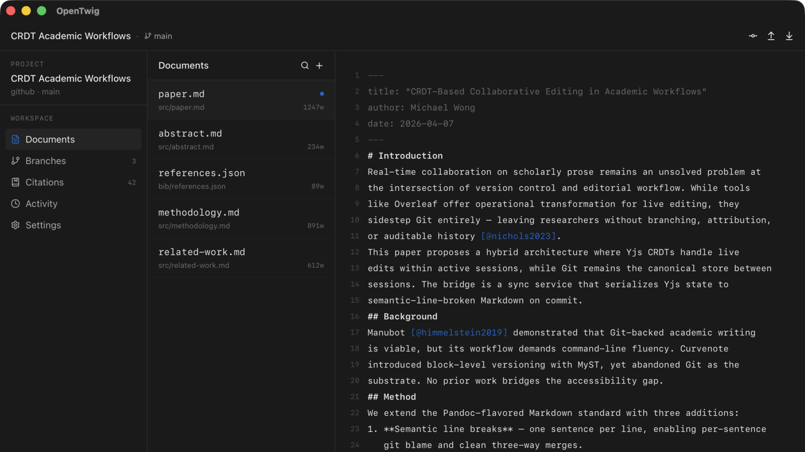

OpenTwig is a desktop app that brings Git-native version control to academic writing without forcing researchers to learn the command line. It treats branching as "draft revisions," merges as "accept these changes," and citations as first-class reviewable events — closing the gap between Overleaf-style collaboration and Manubot-style auditability.

## Screenshots

## How it works

The canonical store for every project is a Git repository — local or hosted on any forge. Documents are Pandoc-flavored Markdown with semantic line breaks (one sentence per line), so `git diff` and `git blame` work at sentence granularity and three-way merges stay localized.

Each project is bound to its own **Git server** during onboarding. Users pick from GitHub, GitLab, Codeberg, Bitbucket, or a self-hosted Gitea instance — or enter a custom API + web URL for any forge. Tokens are stored in the OS keyring, scoped per server, never in config files.

When two contributors edit the same paragraph on different branches, a read-only worker calls Claude with the base/ours/theirs text plus surrounding context, validates citations against the bibliography, and proposes a resolution — but never auto-applies it. Humans always merge.

The desktop shell is built with Tauri so the same codebase ships to macOS, Windows, and Linux from a single Rust + React tree. Git operations call libgit2 directly via `git2-rs`; there is no shell-out to the `git` CLI.

## Stack

- Tauri 2 (Rust backend, native WebView frontend)
- React 18 + TypeScript + Vite
- Tailwind CSS v4
- Zustand for client state
- git2-rs (libgit2 vendored) for all Git operations
- rusqlite (bundled SQLite) for project + git server metadata
- keyring crate for OS-native credential storage
- Anthropic Claude API for merge conflict resolution

## Status

In progress
